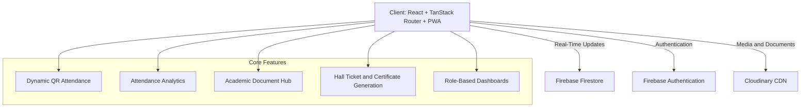

# 🎓 Advanced Attendance Management System

### Enterprise-Grade Campus Attendance & Academic Intelligence Platform

<p align="left">
  <a href="https://react.dev/">
    
  </a>
  <a href="https://www.typescriptlang.org/">
    
  </a>
  <a href="https://tailwindcss.com/">
    
  </a>
  <a href="https://firebase.google.com/">
    
  </a>
  <a href="https://tanstack.com/router">
    
  </a>
  <a href="https://vite.dev/">
    
  </a>
  <a href="https://cloudinary.com/">
    
  </a>
  <a href="https://www.npmjs.com/">
    
  </a>
  <a href="https://opensource.org/licenses/MIT">
    
  </a>
</p>

---

### 📌 Table of Contents

* 🏛️ [Executive Overview](#-executive-overview)
* 📐 [System Architecture](#-system-architecture)
* 📂 [Directory Structure](#-comprehensive-directory-structure)
* 🔑 [API Keys & Configuration](#-api-keys-secrets--configuration-guide)
* 🛡️ [Role-Based Access Control](#-role-based-access-control-rbac)
* ⚡ [Key Engineering Highlights](#-key-engineering-highlights)
* 🚀 [Local Setup](#-local-setup--quickstart)
* 🗄️ [Firestore Schema](#-firestore-schema--data-collections)
* 🚢 [Production Deployment](#-production-deployment)
* 🤝 [Contributing](#-contributing--code-standards)
* 📄 [License](#-license)

---
# 🎓 Advanced Attendance Management System

### Enterprise-Grade Campus Attendance & Academic Intelligence Platform

[](https://react.dev/)
[](https://www.typescriptlang.org/)
[](https://tailwindcss.com/)
[](https://firebase.google.com/)
[](https://tanstack.com/router)
[](https://vite.dev/)
[](https://cloudinary.com/)
[](LICENSE)

---

## 📌 Table of Contents

* [Executive Overview](#-executive-overview)
* [System Architecture](#-system-architecture)
* [Comprehensive Directory Structure](#-comprehensive-directory-structure)
* [API Keys, Secrets & Configuration](#-api-keys-secrets--configuration-guide)

  * [Firebase Integration](#1-firebase-database--authentication)
  * [Cloudinary Integration](#2-cloudinary-media--document-storage)
  * [Environment Variables](#3-environment-variables-setup)
* [Role-Based Access Control](#-role-based-access-control-rbac)
* [Key Engineering Highlights](#-key-engineering-highlights)
* [Local Setup & Quickstart](#-local-setup--quickstart)
* [Firestore Schema](#-firestore-schema--data-collections)
* [Production Deployment](#-production-deployment)
* [Contributing](#-contributing--code-standards)
* [License](#-license)

---

## 🏛 Executive Overview

The **Advanced Attendance Management System** is a modern campus management platform designed to simplify attendance tracking, examination eligibility calculations, academic scheduling, document management, and communication between students, teachers, administrators, and parents.

The platform incorporates dynamic QR-based attendance, role-based access control, real-time database synchronization, academic analytics, and digital document management to improve the efficiency and transparency of academic operations.

Its architecture is designed to support responsive access across desktop and mobile devices while keeping attendance records and academic workflows organized.

---

## 📐 System Architecture



---

## 📂 Comprehensive Directory Structure

The project follows a modular structure that separates reusable UI components, feature-specific functionality, application routing, and infrastructure services.

```text
studatt/
├── .agents/
├── public/
│   ├── favicon.svg
│   └── manifest.json
│
├── src/
│   ├── components/
│   │   ├── common/
│   │   │   ├── data-table.tsx
│   │   │   ├── empty-state.tsx
│   │   │   ├── page-header.tsx
│   │   │   ├── panel.tsx
│   │   │   ├── stat-card.tsx
│   │   │   └── status-pill.tsx
│   │   ├── layout/
│   │   │   ├── app-shell.tsx
│   │   │   └── notifications-panel.tsx
│   │   └── ui/
│   │       ├── button.tsx
│   │       ├── dialog.tsx
│   │       ├── dropdown-menu.tsx
│   │       ├── input.tsx
│   │       ├── label.tsx
│   │       ├── select.tsx
│   │       ├── switch.tsx
│   │       ├── tabs.tsx
│   │       ├── textarea.tsx
│   │       └── tooltip.tsx
│   │
│   ├── features/
│   │   ├── academics/
│   │   │   ├── components/
│   │   │   │   ├── announcements-view.tsx
│   │   │   │   └── leave-view.tsx
│   │   │   └── index.ts
│   │   ├── admin/
│   │   │   ├── components/
│   │   │   │   ├── admin-dashboard.tsx
│   │   │   │   ├── audit-logs-view.tsx
│   │   │   │   ├── holidays-view.tsx
│   │   │   │   ├── semesters-view.tsx
│   │   │   │   └── timetable-view.tsx
│   │   │   └── index.ts
│   │   ├── analytics/
│   │   │   ├── components/
│   │   │   │   └── analytics-view.tsx
│   │   │   └── index.ts
│   │   ├── attendance/
│   │   │   ├── attendance-service.ts
│   │   │   ├── qr-generator.ts
│   │   │   ├── components/
│   │   │   │   ├── qr-display.tsx
│   │   │   │   └── qr-scanner.tsx
│   │   │   └── index.ts
│   │   ├── auth/
│   │   │   ├── auth-context.tsx
│   │   │   ├── user-store.ts
│   │   │   ├── components/
│   │   │   │   ├── login-view.tsx
│   │   │   │   ├── otp-view.tsx
│   │   │   │   └── signup-view.tsx
│   │   │   └── index.ts
│   │   ├── engagement/
│   │   │   ├── components/
│   │   │   │   ├── achievements-view.tsx
│   │   │   │   ├── assistant-view.tsx
│   │   │   │   └── leaderboard-view.tsx
│   │   │   └── index.ts
│   │   ├── parent/
│   │   │   ├── components/
│   │   │   │   ├── messages-view.tsx
│   │   │   │   └── parent-dashboard.tsx
│   │   │   └── index.ts
│   │   ├── security/
│   │   │   ├── components/
│   │   │   │   └── profile-view.tsx
│   │   │   └── index.ts
│   │   ├── student/
│   │   │   ├── components/
│   │   │   │   ├── eligibility-view.tsx
│   │   │   │   └── student-dashboard.tsx
│   │   │   └── index.ts
│   │   └── teacher/
│   │       ├── components/
│   │       │   ├── approvals-view.tsx
│   │       │   ├── materials-view.tsx
│   │       │   └── teacher-dashboard.tsx
│   │       └── index.ts
│   │
│   ├── lib/
│   │   ├── cloudinary/
│   │   │   └── uploader.ts
│   │   ├── data/
│   │   │   ├── index.ts
│   │   │   └── mock-data.ts
│   │   ├── firebase/
│   │   │   ├── config.ts
│   │   │   └── index.ts
│   │   └── utils/
│   │       └── index.ts
│   │
│   ├── routes/
│   │   ├── __root.tsx
│   │   ├── _admin/
│   │   ├── _auth/
│   │   ├── _parent/
│   │   ├── _portal/
│   │   ├── _student/
│   │   └── _teacher/
│   │
│   ├── routeTree.gen.ts
│   ├── router.tsx
│   └── styles.css
│
├── .env.example
├── package.json
├── tsconfig.json
└── vite.config.ts
```

*Note: The structure above reflects the supplied project outline. Verify it against the actual repository before treating it as an exact file inventory.*

---

## 🔑 API Keys, Secrets & Configuration Guide

To run the project locally, configure your own Firebase and Cloudinary accounts. Never commit private credentials or production secrets to GitHub.

### 1. Firebase Database & Authentication

**Configuration file:** `src/lib/firebase/config.ts`

**Services:** Firebase Authentication and Cloud Firestore.

1. Open the [Firebase Console](https://console.firebase.google.com/) and create a project.
2. Register a web application in **Project Settings → General → Your Apps**.
3. Enable Cloud Firestore and configure appropriate database security rules.
4. Enable the authentication methods required by the application.
5. Add the relevant Firebase configuration values to your local `.env` file.

### 2. Cloudinary Media & Document Storage

**Configuration file:** `src/lib/cloudinary/uploader.ts`

**Service:** Cloudinary media and document hosting.

1. Create an account at [Cloudinary](https://cloudinary.com/).
2. Find your cloud name and other required configuration values in the dashboard.
3. Configure an upload preset under **Settings → Upload → Upload Presets**.
4. Add the required values to your `.env` file.

**Security note:** Do not expose your Cloudinary API secret in browser-side code. For direct browser uploads, use a carefully restricted unsigned upload preset or implement signed uploads through a trusted backend.

### 3. Environment Variables Setup

Create a local `.env` file using `.env.example` as a template.

```bash
cp .env.example .env
```

Example configuration:

```ini
# Firebase
VITE_FIREBASE_API_KEY=your_firebase_api_key
VITE_FIREBASE_AUTH_DOMAIN=your_project.firebaseapp.com
VITE_FIREBASE_PROJECT_ID=your_project_id
VITE_FIREBASE_STORAGE_BUCKET=your_storage_bucket
VITE_FIREBASE_MESSAGING_SENDER_ID=your_sender_id
VITE_FIREBASE_APP_ID=your_firebase_app_id
VITE_FIREBASE_MEASUREMENT_ID=your_measurement_id

# Cloudinary
VITE_CLOUDINARY_CLOUD_NAME=your_cloud_name
VITE_CLOUDINARY_UPLOAD_PRESET=your_upload_preset
```

Only add variables that your source code actually reads. In Vite, variables prefixed with `VITE_` are bundled for client-side access, so **never store private API secrets in them**.

---

## 🛡 Role-Based Access Control (RBAC)

The application is designed around role-specific workflows for students, teachers, department heads, administrators, and parents.

| Feature                  | Student | Teacher | HOD | Admin | Parent |
| ------------------------ | :-----: | :-----: | :-: | :---: | :----: |
| Scan QR attendance       |    ✅    |    ❌    |  ❌  |   ❌   |    ❌   |
| Broadcast classroom QR   |    ❌    |    ✅    |  ✅  |   ❌   |    ❌   |
| Upload study materials   |    ❌    |    ✅    |  ✅  |   ✅   |    ❌   |
| Download study materials |    ✅    |    ✅    |  ✅  |   ✅   |    ❌   |
| Submit leave requests    |    ✅    |    ❌    |  ❌  |   ❌   |    ❌   |
| Review leave requests    |    ❌    |    ✅    |  ✅  |   ✅   |    ❌   |
| Publish announcements    |    ❌    |    ✅    |  ✅  |   ✅   |    ❌   |
| View announcements       |    ✅    |    ✅    |  ✅  |   ✅   |    ✅   |
| Configure timetable      |    ❌    |    ❌    |  ✅  |   ✅   |    ❌   |
| Register faculty/admin   |    ❌    |    ❌    |  ❌  |   ✅   |    ❌   |
| Self-registration        |    ✅    |    ❌    |  ❌  |   ❌   |    ✅   |
| Generate hall tickets    |    ✅    |    ❌    |  ❌  |   ✅   |    ❌   |

*Actual permissions depend on the application's implemented authorization logic and database security rules.*

---

## ⚡ Key Engineering Highlights

### 1. Dynamic QR Attendance

* Rotating QR tokens are intended to reduce attendance proxy attempts.
* QR sessions can be associated with classroom, faculty, and session information.
* Token expiry and server-side validation should be enforced to prevent replay attacks.

### 2. Real-Time State Synchronization

* Firebase Firestore listeners can synchronize attendance and academic updates.
* UI state can respond to updates without requiring manual page refreshes.
* Local synchronization may help coordinate updates between browser views.

### 3. Progressive Web App & Responsive Design

* Responsive interfaces for desktop and mobile browsers.
* PWA manifest support for installable experiences.
* Local caching can improve resilience during connectivity interruptions.

### 4. Academic Intelligence & Document Management

* Attendance analytics and subject-wise summaries.
* Leave requests and supporting document uploads.
* Academic announcements, timetable management, and eligibility workflows.
* Role-specific dashboards for students, teachers, administrators, and parents.

---

## 🚀 Local Setup & Quickstart

### Prerequisites

* [Node.js](https://nodejs.org/) — use a version compatible with the project dependencies.
* npm, included with Node.js.
* A Firebase project.
* A Cloudinary account if media uploads are enabled.

### Installation

**1. Clone the repository**

```bash
git clone https://github.com/your-username/your-repository.git
cd your-repository
```

Replace the repository URL and directory with your actual project details.

**2. Install dependencies**

```bash
npm install
```

**3. Configure environment variables**

```bash
cp .env.example .env
```

Add the required Firebase and Cloudinary values to `.env`.

**4. Start the development server**

```bash
npm run dev
```

Open the local URL printed in your terminal. Vite commonly uses `http://localhost:5173`.

**5. Build for production**

```bash
npm run build
```

**6. Preview the production build**

```bash
npm run preview
```

---

## 🗄 Firestore Schema & Data Collections

The supplied project outline references the following Firestore collections.

| Collection           | Example Fields                                                                                  | Purpose                    |
| -------------------- | ----------------------------------------------------------------------------------------------- | -------------------------- |
| `attendance_records` | `studentId`, `studentName`, `subject`, `room`, `status`, `timestamp`, `device`                  | Attendance records         |
| `leave_requests`     | `studentName`, `studentRoll`, `type`, `fromDate`, `toDate`, `reason`, `status`, `attachmentUrl` | Leave and medical requests |
| `course_materials`   | `name`, `fileUrl`, `subject`, `course`, `uploadedBy`, `downloads`                               | Shared academic resources  |
| `announcements`      | `title`, `body`, `author`, `category`, `date`, `pinned`                                         | Academic announcements     |
| `timetable_slots`    | `day`, `timeSlot`, `course`, `division`, `room`, `subjectCode`, `facultyName`                   | Lecture and lab scheduling |
| `live_session`       | `slotId`, `subject`, `room`, `token`, `secondsRemaining`, `active`                              | Active attendance sessions |

*Collection names and fields should be checked against the actual Firestore implementation.*

---

## 🚢 Production Deployment

### Deploying to Vercel or Netlify

1. Push the project to your GitHub repository.
2. Import the repository into [Vercel](https://vercel.com/) or [Netlify](https://www.netlify.com/).
3. Configure the build command as `npm run build`.
4. Set the output directory to `dist`.
5. Add the required client-side environment variables in the deployment settings.
6. Verify Firebase Authentication domains, Firestore security rules, and Cloudinary upload restrictions.
7. Deploy and test the application on desktop and mobile devices.

### Production Security Checklist

* [ ] Apply least-privilege Firestore security rules.
* [ ] Validate attendance sessions and QR expiry.
* [ ] Prevent reuse of expired or previously accepted QR tokens.
* [ ] Restrict administrative operations to authorized roles.
* [ ] Avoid storing private credentials in frontend environment variables.
* [ ] Test authorization rules before handling real student records.

---

## 🤝 Contributing & Code Standards

Contributions and improvements are welcome.

1. **Branch naming:** Use descriptive names such as `feature/attendance-analytics`, `fix/qr-validation`, or `refactor/auth`.
2. **TypeScript:** Prefer explicit types and well-defined interfaces.
3. **Code quality:** Keep components modular and reusable.
4. **Commit messages:** Follow [Conventional Commits](https://www.conventionalcommits.org/), for example `feat: add attendance analytics`.
5. **Security:** Never commit credentials, private keys, or real student data.

---

## 📄 License

This project is distributed under the **MIT License**. See the [`LICENSE`](LICENSE) file for details.

If the repository does not already contain a `LICENSE` file, add the full MIT License text before describing the project as officially MIT-licensed.

---

<p align="center">
  <strong>Advanced Attendance Management System</strong><br>
  <sub>Designed and developed by <a href="https://github.com/adilraj786">Adil Raj</a></sub>
</p>
